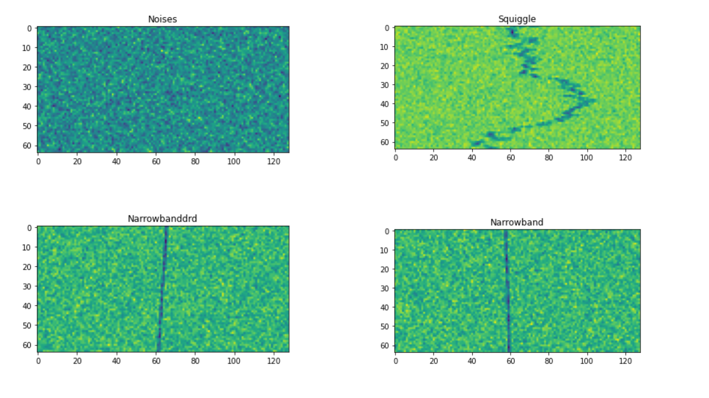

# Classifying Radio Signals with PyTorch

This project involves loading a pre-trained state-of-the-art CNN to classify radio signals (with inputs as spectogram images) into Squiggle, Noises, Narrowband, etc. Furthermore, we apply spectogram augmentation using time & frequency masking. This could practically be used in contexts involving military, security, telecommunications, and space technology.

## Dataset Description

